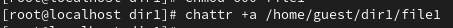
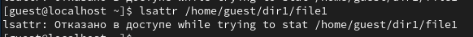
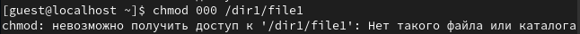
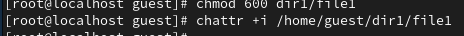
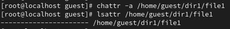

---
## Front matter
title: "Лабораторная работа №3"
author: "Павлова Варвара Юрьевна"

## Generic otions
lang: ru-RU
toc-title: "Содержание"

## Bibliography
bibliography: bib/cite.bib
csl: pandoc/csl/gost-r-7-0-5-2008-numeric.csl

## Pdf output format
toc: true # Table of contents
toc-depth: 2
lof: true # List of figures
lot: true # List of tables
fontsize: 12pt
linestretch: 1.5
papersize: a4
documentclass: scrreprt
## I18n polyglossia
polyglossia-lang:
  name: russian
  options:
	- spelling=modern
	- babelshorthands=true
polyglossia-otherlangs:
  name: english
## I18n babel
babel-lang: russian
babel-otherlangs: english
## Fonts
mainfont: PT Serif
romanfont: PT Serif
sansfont: PT Sans
monofont: PT Mono
mainfontoptions: Ligatures=TeX
romanfontoptions: Ligatures=TeX
sansfontoptions: Ligatures=TeX,Scale=MatchLowercase
monofontoptions: Scale=MatchLowercase,Scale=0.9
## Biblatex
biblatex: true
biblio-style: "gost-numeric"
biblatexoptions:
  - parentracker=true
  - backend=biber
  - hyperref=auto
  - language=auto
  - autolang=other*
  - citestyle=gost-numeric
## Pandoc-crossref LaTeX customization
figureTitle: "Рис."
tableTitle: "Таблица"
listingTitle: "Листинг"
lofTitle: "Список иллюстраций"
lotTitle: "Список таблиц"
lolTitle: "Листинги"
## Misc options
indent: true
header-includes:
  - \usepackage{indentfirst}
  - \usepackage{float} # keep figures where there are in the text
  - \floatplacement{figure}{H} # keep figures where there are in the text
---

# Цель работы

Получение практических навыков работы в консоли с расширенными атрибутами файлов.

# Ход работы

**1.** От имени пользователя guest определите расширенные атрибуты файла /home/guest/dir1/file1 командой: (рис. [-@fig:001])

{ #fig:001 width=70% }

**2.** Установите командой chmod 600 file1 на файл file1 права, разрешающие чтение и запись для владельца файла: (рис. [-@fig:002])

{ #fig:002 width=70% }

**3.** Попробуйте установить на файл /home/guest/dir1/file1 расширенный атрибут a от имени пользователя guest:(рис. [-@fig:003])

{ #fig:003 width=70% }

**4.** Зайдите на третью консоль с правами администратора либо повысьте свои права с помощью команды su. Попробуйте установить расширенный атрибут a на файл /home/guest/dir1/file1 от имени суперпользователя: (рис. [-@fig:004])

{ #fig:004 width=70% }
  
**5.** От пользователя guest проверьте правильность установления атрибута: (рис. [-@fig:005])

{ #fig:005 width=70% }

**6.**  Выполните дозапись в файл file1 слова «test» командой: (рис. [-@fig:006])

{ #fig:006 width=70% }

**7.** Попробуйте удалить файл file1 либо стереть имеющуюся в нём информацию: (рис. [-@fig:007])

{ #fig:007 width=70% }

**8.** Попробуйте с помощью команды chmod 000 file1 установить на файл file1 права, например, запрещающие чтение и запись для владельца файла. (рис. [-@fig:008])

{ #fig:008 width=70% }

**9.** Снимите расширенный атрибут a с файла /home/guest/dirl/file1 от имени суперпользователя командой (рис. [-@fig:009])

{ #fig:009 width=70% }

**10.** Повторите ваши действия по шагам, заменив атрибут «a» атрибутом «i». (рис. [-@fig:010])

{ #fig:010 width=70% }

# Вывод

В ходе выполнения данной лабораторной работы я получила практические навыки работы в консоли с с расширенными атрибутами файлов.