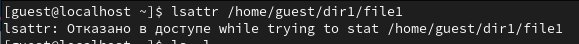
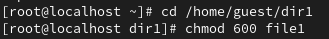
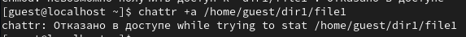
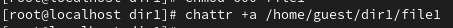
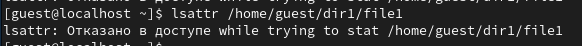
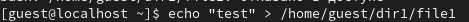
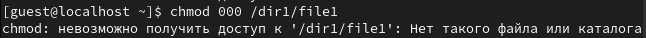
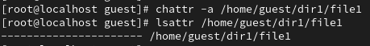
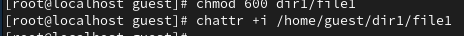

---
## Front matter
lang: ru-RU
title: Лабораторная работы №4
author: Павлова В.Ю.
institute: RUDN University, Moscow, Russian Federation

## Formatting
toc: false
slide_level: 2
theme: metropolis
header-includes: 
 - \metroset{progressbar=frametitle,sectionpage=progressbar,numbering=fraction}
 - '\makeatletter'
 - '\beamer@ignorenonframefalse'
 - '\makeatother'
aspectratio: 43
section-titles: true
---

## Цель работы

Получение практических навыков работы в консоли с расширенными атрибутами файлов.

---

## Ход работы

От имени пользователя guest определите расширенные атрибуты файла /home/guest/dir1/file1 командой: (рис. [-@fig:001])

{ #fig:001 width=70% }
---

## Ход работы

Установите командой chmod 600 file1 на файл file1 права, разрешающие чтение и запись для владельца файла: (рис. [-@fig:002])

{ #fig:002 width=70% }

---

## Ход работы

Попробуйте установить на файл /home/guest/dir1/file1 расширенный атрибут a от имени пользователя guest:(рис. [-@fig:003])

{ #fig:003 width=70% }

---

## Ход работы

Зайдите на третью консоль с правами администратора либо повысьте свои права с помощью команды su. Попробуйте установить расширенный атрибут a на файл /home/guest/dir1/file1 от имени суперпользователя: (рис. [-@fig:004])

{ #fig:004 width=70% }

---

## Ход работы

От пользователя guest проверьте правильность установления атрибута: (рис. [-@fig:005])

{ #fig:005 width=70% }

---

## Ход работы

 Выполните дозапись в файл file1 слова «test» командой: (рис. [-@fig:006])

{ #fig:006 width=70% }

---

## Ход работы

Попробуйте удалить файл file1 либо стереть имеющуюся в нём информацию: (рис. [-@fig:007])

{ #fig:007 width=70% }

---

## Ход работы

Попробуйте с помощью команды chmod 000 file1 установить на файл file1 права, например, запрещающие чтение и запись для владельца файла. (рис. [-@fig:008])

{ #fig:008 width=70% }

---

## Ход работы

Снимите расширенный атрибут a с файла /home/guest/dirl/file1 от имени суперпользователя командой (рис. [-@fig:009])

{ #fig:009 width=70% }

---

## Ход работы

Повторите ваши действия по шагам, заменив атрибут «a» атрибутом «i». (рис. [-@fig:010])

{ #fig:010 width=70% }

---

## Вывод

В ходе выполнения данной лабораторной работы я получила практические навыки работы в консоли с с расширенными атрибутами файлов.