---
## Front matter
lang: ru-RU
title: Лабораторная работы №5
author: Павлова В.Ю.
institute: RUDN University, Moscow, Russian Federation

## Formatting
toc: false
slide_level: 2
theme: metropolis
header-includes: 
 - \metroset{progressbar=frametitle,sectionpage=progressbar,numbering=fraction}
 - '\makeatletter'
 - '\beamer@ignorenonframefalse'
 - '\makeatother'
aspectratio: 43
section-titles: true
---

## Цель работы

Изучение механизмов изменения идентификаторов, применения SetUID- и Sticky-битов. Получение практических навыков работы в консоли с дополнительными атрибутами. Рассмотрение работы механизма смены идентификатора процессов пользователей, а также влияние бита Sticky на запись и удаление файлов.

---

## Ход работы

Войдите в систему от имени пользователя guest.

Создайте программу simpleid.c:: (рис. [-@fig:001]) (рис. [-@fig:002])

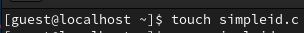{ #fig:001 width=70% }

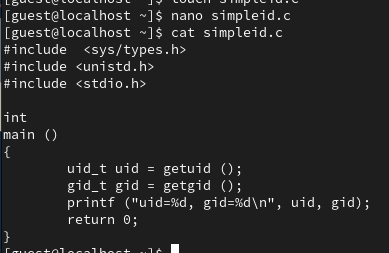{ #fig:002 width=70% }

---

## Ход работы

комплилируйте программу и убедитесь, что файл программы создан: (рис. [-@fig:003])

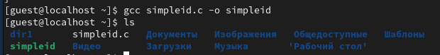{ #fig:003 width=70% }

Выполните программу simpleid: (рис. [-@fig:004])

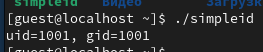{ #fig:004 width=70% }

---

## Ход работы

Выполните системную программу id: (рис. [-@fig:005])

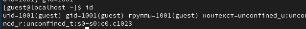{ #fig:005 width=70% }

---

## Ход работы

Усложните программу, добавив вывод действительных идентификаторов: (рис. [-@fig:006])

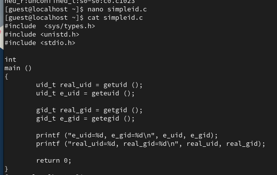{ #fig:006 width=70% }

Скомпилируйте и запустите simpleid2.c: (рис. [-@fig:007])

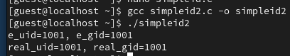{ #fig:007 width=70% }

---

## Ход работы

От имени суперпользователя выполните команды: (рис. [-@fig:008])

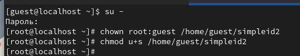{ #fig:008 width=70% }

Выполните проверку правильности установки новых атрибутов и смены владельца файла simpleid2: (рис. [-@fig:009])

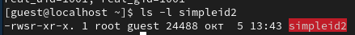{ #fig:009 width=70% }

---

## Ход работы

Запустите simpleid2 и id: (рис. [-@fig:010])

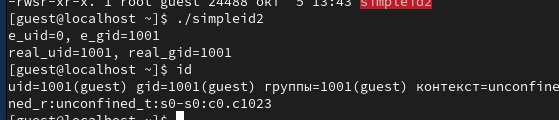{ #fig:010 width=70% 

---

## Ход работы

Создайте программу readfile.c:(рис. [-@fig:011])

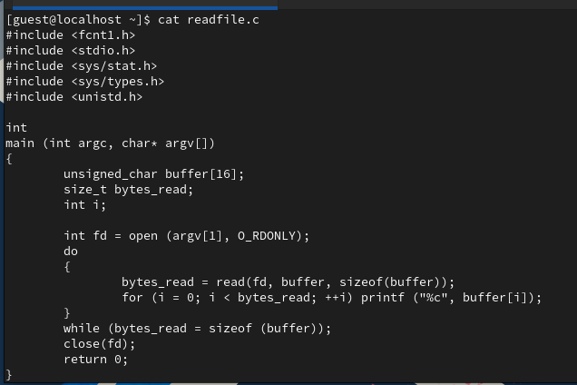{ #fig:011 width=70% }

Откомпилируйте её. (рис. [-@fig:012])

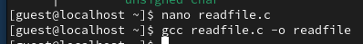{ #fig:012 width=70% }

---

## Ход работы

Смените владельца у файла readfile.c (или любого другого текстового файла в системе) и измените права так, чтобы только суперпользователь (root) мог прочитать его, a guest не мог. (рис. [-@fig:013])

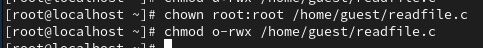{ #fig:013 width=70% }

Проверьте, что пользователь guest не может прочитать файл readfile.c.(рис. [-@fig:014])

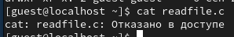{ #fig:14 width=70% }

---

## Ход работы

Смените у программы readfile владельца и установите SetU’D-бит. (рис. [-@fig:015])

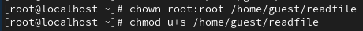{ #fig:015 width=70% }

---

## Ход работы

Проверьте, может ли программа readfile прочитать файл readfile.c? (рис. [-@fig:016])

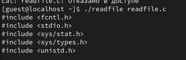{ #fig:016 width=70% }

Проверьте, может ли программа readfile прочитать файл /etc/shadow? (рис. [-@fig:017])

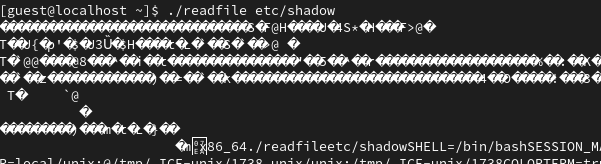{ #fig:017 width=70% }

---

## Ход работы

Выясните, установлен ли атрибут Sticky на директории /tmp (рис. [-@fig:018])

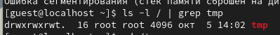{ #fig:018 width=70% }

---

## Ход работы

От имени пользователя guest создайте файл file01.txt в директории /tmp со словом test: (рис. [-@fig:019])

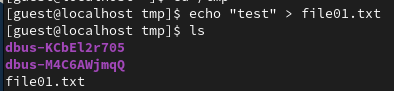{ #fig:019 width=70% }

Просмотрите атрибуты у только что созданного файла и разрешите чтение и запись для категории пользователей «все остальные»: (рис. [-@fig:020])

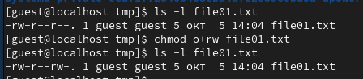{ #fig:020 width=70% }

---

## Ход работы

От пользователя guest2 (не являющегося владельцем) попробуйте прочитать файл /tmp/file01.txt:(рис. [-@fig:021])

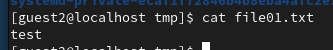{ #fig:021 width=70% }

От пользователя guest2 попробуйте дозаписать в файл /tmp/file01.txt слово test2 (рис. [-@fig:022])

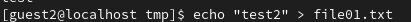{ #fig:022 width=70% }

Проверьте содержимое файла командой(рис. [-@fig:023])

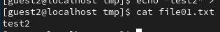{ #fig:023 width=70% }

---

## Ход работы

От пользователя guest2 попробуйте записать в файл /tmp/file01.txt слово test3(рис. [-@fig:024])

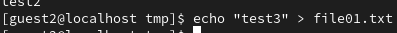{ #fig:024 width=70% }

Проверьте содержимое файла командой(рис. [-@fig:025])

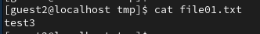{ #fig:025 width=70% }

---

## Ход работы

От пользователя guest2 попробуйте удалить файл /tmp/file01.txt командой (рис. [-@fig:026])

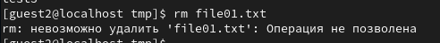{ #fig:026 width=70% }

---

## Ход работы

Повысьте свои права до суперпользователя и выполните после этого команду, снимающую атрибут t (Sticky-бит) с директории /tmp:(рис. [-@fig:027])

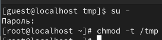{ #fig:027 width=70% }

От пользователя guest2 проверьте, что атрибута t у директории /tmp нет: (рис. [-@fig:028])

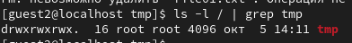{ #fig:028 width=70% }

---

## Ход работы

Удалось ли вам удалить файл от имени пользователя, не являющегося его владельцем?(рис. [-@fig:029])

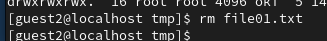{ #fig:029 width=70% }

---

## Ход работы

Повысьте свои права до суперпользователя и верните атрибут t на директорию /tmp: (рис. [-@fig:030])

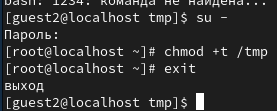{ #fig:030 width=70% }

---

## Вывод

В ходе выполнения данной лабораторной работы я изучила механизмы изменения идентификаторов, применения SetUID- и Sticky-битов. Получила практические навыки работы в консоли с дополнительными атрибутами. Рассмотрела работу механизма смены идентификатора процессов пользователей, а также влияние бита Sticky на запись и удаление файлов.