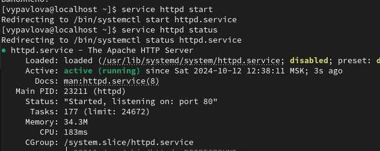
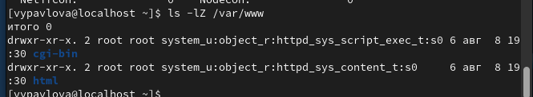
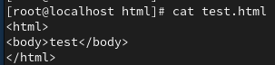
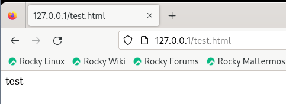
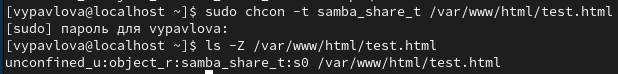
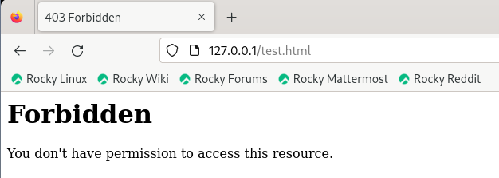
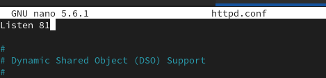
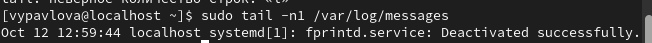
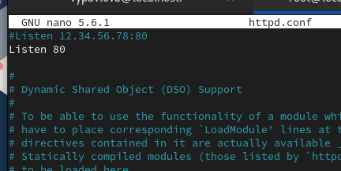

---
## Front matter
title: "Лабораторная работа №6"
author: "Павлова Варвара Юрьевна"

## Generic otions
lang: ru-RU
toc-title: "Содержание"

## Bibliography
bibliography: bib/cite.bib
csl: pandoc/csl/gost-r-7-0-5-2008-numeric.csl

## Pdf output format
toc: true # Table of contents
toc-depth: 2
lof: true # List of figures
lot: true # List of tables
fontsize: 12pt
linestretch: 1.5
papersize: a4
documentclass: scrreprt
## I18n polyglossia
polyglossia-lang:
  name: russian
  options:
	- spelling=modern
	- babelshorthands=true
polyglossia-otherlangs:
  name: english
## I18n babel
babel-lang: russian
babel-otherlangs: english
## Fonts
mainfont: PT Serif
romanfont: PT Serif
sansfont: PT Sans
monofont: PT Mono
mainfontoptions: Ligatures=TeX
romanfontoptions: Ligatures=TeX
sansfontoptions: Ligatures=TeX,Scale=MatchLowercase
monofontoptions: Scale=MatchLowercase,Scale=0.9
## Biblatex
biblatex: true
biblio-style: "gost-numeric"
biblatexoptions:
  - parentracker=true
  - backend=biber
  - hyperref=auto
  - language=auto
  - autolang=other*
  - citestyle=gost-numeric
## Pandoc-crossref LaTeX customization
figureTitle: "Рис."
tableTitle: "Таблица"
listingTitle: "Листинг"
lofTitle: "Список иллюстраций"
lotTitle: "Список таблиц"
lolTitle: "Листинги"
## Misc options
indent: true
header-includes:
  - \usepackage{indentfirst}
  - \usepackage{float} # keep figures where there are in the text
  - \floatplacement{figure}{H} # keep figures where there are in the text
---

# Цель работы

Развить навыки администрирования ОС Linux. Получить первое практическое знакомство с технологией SELinux.
Проверить работу SELinx на практике совместно с веб-сервером Apache.

# Ход работы

**1.** Войдите в систему с полученными учётными данными и убедитесь, что SELinux работает в режиме enforcing политики targeted с помощью команд getenforce и sestatus. (рис. [-@fig:001])

{ #fig:001 width=70% }

**2.** Обратитесь с помощью браузера к веб-серверу, запущенному на вашем компьютере, и убедитесь, что последний работает(рис. [-@fig:002])

{ #fig:002 width=70% }

**3.** Найдите веб-сервер Apache в списке процессов, определите его контекст безопасности(рис. [-@fig:003])

{ #fig:003 width=70% }

**4.**  Посмотрите текущее состояние переключателей SELinux для Apache(рис. [-@fig:004])

{ #fig:004 width=70% }
  
**5.** Посмотрите статистику по политике с помощью команды seinfo (рис. [-@fig:005])

{ #fig:005 width=70% }

**6.**  Определите тип файлов и поддиректорий, находящихся в директории /var/www (рис. [-@fig:006])

{ #fig:006 width=70% }

**7.** Определите тип файлов, находящихся в директории /var/www/html (рис. [-@fig:008])

{ #fig:007 width=70% }

**8.** Создайте от имени суперпользователя (так как в дистрибутиве после установки только ему разрешена запись в директорию) html-файл /var/www/html/test.html (рис. [-@fig:008])

{ #fig:008 width=70% }

**9.** Обратитесь к файлу через веб-сервер (рис. [-@fig:009])

{ #fig:009 width=70% }

**10.** Выясните, какие контексты файлов определены для httpd (рис. [-@fig:010])

{ #fig:010 width=70% }

**11.** Измените контекст файла /var/www/html/test.html с httpd_sys_content_t на любой другой, к которому процесс httpd не, должен иметь доступа, например, на samba_share_t (рис. [-@fig:011])

{ #fig:011 width=70% }

**12.** Попробуйте ещё раз получить доступ к файлу через веб-сервер (рис. [-@fig:012])

{ #fig:012 width=70% }

**13.** Проанализируйте ситуацию (рис. [-@fig:013])

{ #fig:013 width=70% }

**14.** Попробуйте запустить веб-сервер Apache на прослушивание ТСР-порта 81 (рис. [-@fig:014])

{ #fig:014 width=70% }

**15.** Выполните перезапуск веб-сервера Apache. (рис. [-@fig:015])

{ #fig:015 width=70% }

**16.** Проанализируйте лог-файлы (рис. [-@fig:016])

{ #fig:016 width=70% }

**17.** Выполните команду semanage port -a -t http_port_t -р tcp 81 (рис. [-@fig:017])

{ #fig:017 width=70% }

**18.** Попробуйте запустить веб-сервер Apache ещё раз (рис. [-@fig:018])

{ #fig:018 width=70% }

**19.** Верните контекст httpd_sys_cоntent__t к файлу /var/www/html/ test.html: (рис. [-@fig:019])

{ #fig:019 width=70% }

**20.** Исправьте обратно конфигурационный файл apache, вернув Listen 80. (рис. [-@fig:020])

{ #fig:020 width=70% }

**21.** Удалите файл /var/www/html/test.html (рис. [-@fig:021])

{ #fig:021 width=70% }

# Вывод

В ходе выполнения данной лабораторной работы я развила навыки администрирования ОС Linux, получила первое практическое знакомство с технологией SELinux.
Также я проверила работу SELinx на практике совместно с веб-сервером Apache.