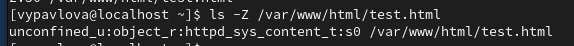
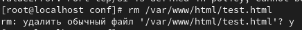

---
## Front matter
lang: ru-RU
title: Лабораторная работы №6
author: Павлова В.Ю.
institute: RUDN University, Moscow, Russian Federation

## Formatting
toc: false
slide_level: 2
theme: metropolis
header-includes: 
 - \metroset{progressbar=frametitle,sectionpage=progressbar,numbering=fraction}
 - '\makeatletter'
 - '\beamer@ignorenonframefalse'
 - '\makeatother'
aspectratio: 43
section-titles: true
---

## Цель работы

Развить навыки администрирования ОС Linux. Получить первое практическое знакомство с технологией SELinux.
Проверить работу SELinx на практике совместно с веб-сервером Apache.

---

## Ход работы

Войдите в систему с полученными учётными данными и убедитесь, что SELinux работает в режиме enforcing политики targeted с помощью команд getenforce и sestatus. (рис. [-@fig:001])

{ #fig:001 width=70% }

---

## Ход работы

Обратитесь с помощью браузера к веб-серверу, запущенному на вашем компьютере, и убедитесь, что последний работает(рис. [-@fig:002])

{ #fig:002 width=70% }

---

## Ход работы

Найдите веб-сервер Apache в списке процессов, определите его контекст безопасности(рис. [-@fig:003])

{ #fig:003 width=70% }

---

## Ход работы

Посмотрите текущее состояние переключателей SELinux для Apache(рис. [-@fig:004])

{ #fig:004 width=70% }

---

## Ход работы

Посмотрите статистику по политике с помощью команды seinfo (рис. [-@fig:005])

{ #fig:005 width=70% }

---

## Ход работы

Определите тип файлов и поддиректорий, находящихся в директории /var/www (рис. [-@fig:006])

{ #fig:006 width=70% }

---

## Ход работы

Определите тип файлов, находящихся в директории /var/www/html (рис. [-@fig:008])

{ #fig:007 width=70% }

---

## Ход работы

Создайте от имени суперпользователя (так как в дистрибутиве после установки только ему разрешена запись в директорию) html-файл /var/www/html/test.html (рис. [-@fig:008])

{ #fig:008 width=70% }

---

## Ход работы

Обратитесь к файлу через веб-сервер (рис. [-@fig:009])

{ #fig:009 width=70% }

---

## Ход работы

Выясните, какие контексты файлов определены для httpd (рис. [-@fig:010])

{ #fig:010 width=70% }

---

## Ход работы

Измените контекст файла /var/www/html/test.html с httpd_sys_content_t на любой другой, к которому процесс httpd не, должен иметь доступа, например, на samba_share_t (рис. [-@fig:011])

{ #fig:011 width=70% }

---

## Ход работы

Попробуйте ещё раз получить доступ к файлу через веб-сервер (рис. [-@fig:012])

{ #fig:012 width=70% }

---

## Ход работы

Проанализируйте ситуацию (рис. [-@fig:013])

{ #fig:013 width=70% }

---

## Ход работы

Попробуйте запустить веб-сервер Apache на прослушивание ТСР-порта 81 (рис. [-@fig:014])

{ #fig:014 width=70% }

---

## Ход работы

Выполните перезапуск веб-сервера Apache. (рис. [-@fig:015])

{ #fig:015 width=70% }

---

## Ход работы

Проанализируйте лог-файлы (рис. [-@fig:016])

{ #fig:016 width=70% }

---

## Ход работы

Выполните команду semanage port -a -t http_port_t -р tcp 81 (рис. [-@fig:017])

{ #fig:017 width=70% }

---

## Ход работы

Попробуйте запустить веб-сервер Apache ещё раз (рис. [-@fig:018])

{ #fig:018 width=70% }

---

## Ход работы

Верните контекст httpd_sys_cоntent__t к файлу /var/www/html/ test.html: (рис. [-@fig:019])

{ #fig:019 width=70% }

---

## Ход работы

Исправьте обратно конфигурационный файл apache, вернув Listen 80. (рис. [-@fig:020])

{ #fig:020 width=70% }

---

## Ход работы

Удалите файл /var/www/html/test.html (рис. [-@fig:021])

{ #fig:021 width=70% }

---

## Вывод

В ходе выполнения данной лабораторной работы я развила навыки администрирования ОС Linux, получила первое практическое знакомство с технологией SELinux.
Также я проверила работу SELinx на практике совместно с веб-сервером Apache.