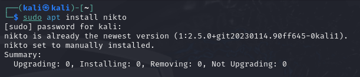
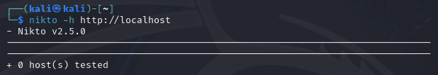
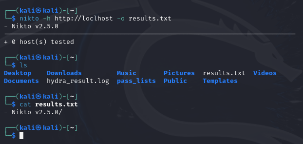

---
## Front matter
lang: ru-RU
title: Индивидуальный проект. Этап №4
author: Павлова В.Ю.
institute: RUDN University, Moscow, Russian Federation

## Formatting
toc: false
slide_level: 2
theme: metropolis
header-includes: 
 - \metroset{progressbar=frametitle,sectionpage=progressbar,numbering=fraction}
 - '\makeatletter'
 - '\beamer@ignorenonframefalse'
 - '\makeatother'
aspectratio: 43
section-titles: true
---

## Цель работы

Использование nikto.

---

## Ход работы

Проверка установки nikto (рис. [-@fig:001])

{ #fig:001 width=70% }

---

## Ход работы

Запуск сканирования localhost (рис. [-@fig:002])

{ #fig:002 width=70% }

---

## Ход работы

Запуск сканирования с выводом результатов в файл (рис. [-@fig:003])

{ #fig:003 width=70% }

---

## Вывод

Мы научились пользоваться nikto