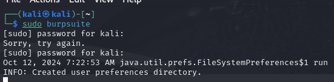

---
## Front matter
lang: ru-RU
title: Индивидуальный проект. Этап №5
author: Павлова В.Ю.
institute: RUDN University, Moscow, Russian Federation

## Formatting
toc: false
slide_level: 2
theme: metropolis
header-includes: 
 - \metroset{progressbar=frametitle,sectionpage=progressbar,numbering=fraction}
 - '\makeatletter'
 - '\beamer@ignorenonframefalse'
 - '\makeatother'
aspectratio: 43
section-titles: true
---

## Цель работы

Использование Burp Suite.

---

## Ход работы

Проверка установки Burp Suite (рис. [-@fig:001])

{ #fig:001 width=70% }

---

## Ход работы

При попытке запуска вылезает ошибка и поэтому к сожалению изучить Burp Suite удается только в теории.
- Нахожу кнопку Proxy->Options и проверяю настройки в разделе Proxy Listeners. 
- Настраиваю работу браузера для работы с Burp Suite 
- Изучаю перехват запросов с Burp Suite 
- Изучаю остальные возможности Burp Suite(анализ и модификация запросов, повторное отправление запросов)

---

## Вывод

Мы научились пользоваться Burp Suite.